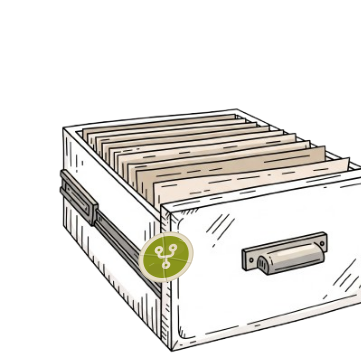
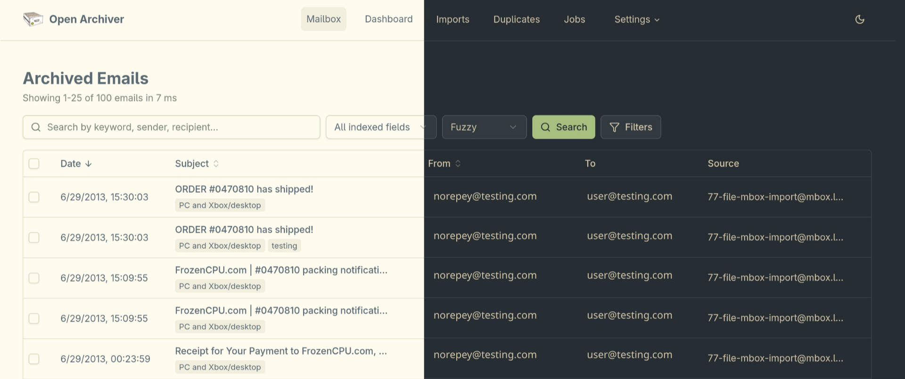
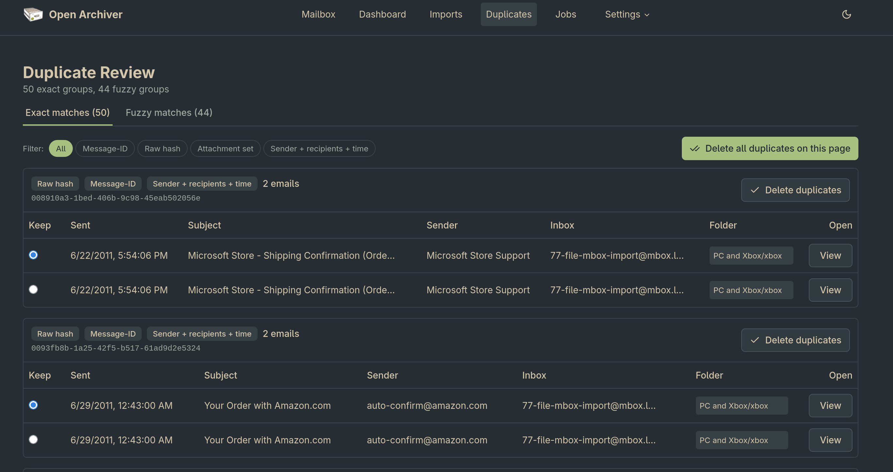

<p align="center">
  
</p>

# PEA (Personal Email Archive)
A fork of [Open Archiver](https://github.com/LogicLabs-OU/OpenArchiver), reworked into a local-only desktop app.

**A lightweight, open-source platform for email archiving.**

This fork focuses on a local only, on device archiver, in order to get emails out of bad email clients or off of email servers, into an app that can handle searching and organizing your emails, completely offline.

The changes in this fork that make it a personal archiver:

- **Now a desktop app:** It runs locally, so no login. One desktop app, one process, zero services.
- **Import from files, no syncing with live mailboxes.** Bring your mail in once from `.mbox` or `.eml` files instead of connecting to email servers, keeping the original folder structure.
- **Your mailbox is the home screen.** Browse and search your whole archive in one place; the dashboard is still there, just not the center.
- **Archives remote content:** It downloads and sanitizes remote content, allowing emails to render correctly without relying on external resources.
- **Fast search and filtering.** Search as you type, by field, tag, source, or attachment, then sort and page through results, every view is a URL you can bookmark.
- **Organize with tags.** Add or remove tags on any email and filter by them.
- **Clean up duplicates.** Exact copies are grouped for one-click removal; near-duplicates are surfaced for review.
- **Emails render correctly offline.** Remote images are saved at import time and shown in a safe preview, so archived mail looks right without going back online.
- **Easier on the eyes:** Uses the [Everforest](https://github.com/sainnhe/everforest) theme


## Screenshots


_Mailbox as the home screen_


_Clean up exact and near-duplicate emails_

## Tech Stack

PEA is a single self-contained process:

- **Desktop shell + engine**: one Rust binary, Tauri v2 window, and the whole
  engine (API, job queue, ingestion, search, crypto) compiled in via `crates/engine`.
  The webview talks to it over an in-process `oa://` protocol
- **Frontend**: SvelteKit with Svelte 5, built as a static SPA served by the engine
- **Database**: SQLite (WAL mode), metadata, application state, **and** the job queue live in one `archive.db` file
- **Search**: SQLite FTS5, weighted BM25 full-text search over subjects, bodies, senders, recipients, and attachment text, inside the same file
- **Packaging**: GitHub Actions → AppImage / `.deb` / `.rpm` / macOS `.dmg`

### Why one binary? (0.6 → 0.7 → 0.8)

0.6 ran as six Node processes coordinating with PostgreSQL, Redis, and
Meilisearch under Docker Compose. 0.7 collapsed all of it into a single Node
process on SQLite. 0.8 rewrote that process in Rust and folded it into the
window binary itself:

|                              | 0.6 (Docker stack)                                                                 | 0.7 (Node desktop app)                | 0.8 (Rust)                                  |
| ---------------------------- | ---------------------------------------------------------------------------------- | -------------------------------------- | -------------------------------------------- |
| **Processes**                | 6 Node processes + 3-4 service containers                                           | 2 (shell + Node engine)                | **1 binary**                                  |
| **Services to run & update** | PostgreSQL, Redis (Valkey), Meilisearch, Tika (opt.)                                | none                                   | **none**                                      |
| **Install footprint**        | ~1.2 GB of Docker images                                                            | 52 MB .deb/.rpm · 143 MB AppImage      | **8.6 MB** .deb/.rpm · 104 MB AppImage        |
| **Engine memory**            | 4 GB machine recommended; Meilisearch alone measured 392 MB on a 100-email archive  | ~200 MB                                | **~10 MB** idle                               |
| **Listening sockets**        | 4+ service ports                                                                    | 1 localhost port                       | **none** (in-process `oa://` protocol)        |
| **Search index on disk**     | 12 MB for 100 emails (~25× text amplification as it grows)                          | 2 MB - inside archive.db (~1.5× text)  | 2 MB - inside archive.db (~1.5× text)         |
| **Search facets**            | silently capped at 100 values                                                       | uncapped                               | uncapped                                      |
| **Installing**               | clone repo → generate .env → docker compose up                                      | one command / one download             | one command / one download                    |
| **Updating**                 | git pull → rebuild image → recreate container                                       | one click in-app (signed)              | **one click in-app** (signed)                 |
| **Backing up**               | pg_dump + three named volumes                                                       | copy `archive.db` + `storage/`         | copy `archive.db` + `storage/`                |
| **Requirements**             | Docker + Compose                                                                    | none (WebKitGTK 4.1 on Linux)          | none (WebKitGTK 4.1 on Linux)                 |

## Installing

PEA ships as a self-contained desktop app. All data lives in one
place. The archive index and full-text search in a single SQLite file
(`archive.db`) next to your encrypted email storage, under
`~/.local/share/pea` (macOS:
`~/Library/Application Support/PEA`; an existing Open Archiver
directory is renamed automatically on first launch). Updates are one click, from
GitHub Releases. Backing up = copying that folder.

#### Linux:
**Arch:** (Arch, Manjaro, EndeavourOS, Omarchy, …): build the native
    package from this repo, it runs against your system WebKitGTK rather than
    the AppImage's bundled copy:
    ```bash
    git clone https://github.com/glengerbush/PEA && cd PEA/packaging/arch && makepkg -si
    ```
    Update by re-running `makepkg -si` after a new release.
    
**Debian:** (Debian, Ubuntu, Mint, Pop!\_OS, …)
Download the `.deb` from the [releases page](https://github.com/glengerbush/PEA/releases)
    and `sudo apt install ./PEA_*_amd64.deb`.
    
**Fedora:** (Fedora, Nobara, openSUSE, …)
Download the `.rpm` from the [releases page](https://github.com/glengerbush/PEA/releases) and
    `sudo dnf install ./PEA-*.rpm` (openSUSE: `sudo zypper install ./PEA-*.rpm`).
    
**Anything else:** Get the AppImage in one command, no root:
    ```bash
    curl -fsSL https://raw.githubusercontent.com/glengerbush/PEA/main/scripts/install-desktop.sh | bash
    ```
    installs it into `~/.local/bin` with a launcher entry and self-updates
    in-app. Note the AppImage bundles its own WebKitGTK; if it aborts with an
    EGL error or opens a blank window, use your distro's native package above
    instead.
    
#### **macOS:** 
Download the `.dmg` from the releases page. The app is unsigned:
  on first launch use System Settings → Privacy & Security → "Open Anyway"
  (or `xattr -cr /Applications/PEA.app`).
- **Running from source**:
  ```bash
  pnpm install && pnpm --filter @pea/types build && pnpm --filter @pea/frontend build
  cargo run -p pea-engine -- --data-dir ~/.local/share/pea --port 47200
  ```
  with `FRONTEND_BUILD_DIR=packages/frontend/build` set, that serves the full
  app in a browser, or `cd apps/desktop && pnpm tauri dev` for the real
  window. The engine also has a CLI importer
  (`pea-engine import --data-dir D --mbox file.mbox`). Releases are cut per
  [RELEASING.md](RELEASING.md).

## Importing Your Email

This fork does not connect to live mailboxes or run continuous ingestion. Instead, you import your existing mail once from static files through the web interface. Two formats are supported:

- **Mbox import:** one or more `.mbox` files, an Apple Mail `.mbox` package, or a folder of them (nested directories are scanned recursively). Upload the files, or point **Local Path** at them on disk, best for large archives, since files are read in place.
- **EML import:** a zip archive of `.eml` files; the folder structure inside the zip is preserved.

Folder structure is preserved from the mailbox layout and email headers where possible, and repeat imports of the same mailbox can be merged into one source. Full guide: [docs](docs/index.md).
